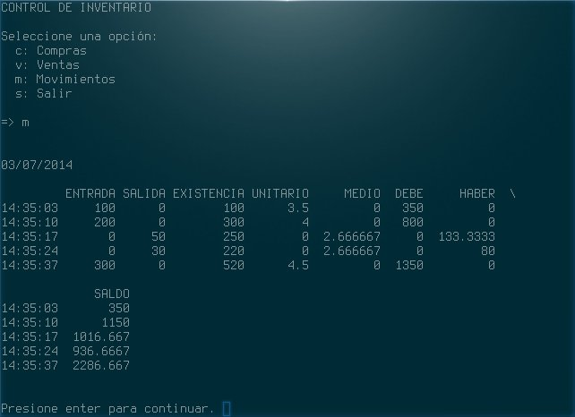

# Control de Inventarios

Programa para administrar inventarios.

* Nota: De momento solo esta implementado el metodo de Promedio Simple.

### Por hacer:

  * Checar que no se retire mas de lo que hay disponible en inventario.
  * Usar decimal.Decimal en vez de floats.
  * Implementar métodos: PEPS, UEPS y Promedio Ponderado.
  * Añadir opcion "u" para mostrar la Utilidad.
  * Checar ortografia. :P
  * Exportar a .csv (.xls ¿?)
  * Generar reporte en HTML (PDF ¿?)
  * Implementar persistencia de datos
    * cpickle 
  * Interfaz grafica Tk.
  * Hacer pruebas en una Mac.
